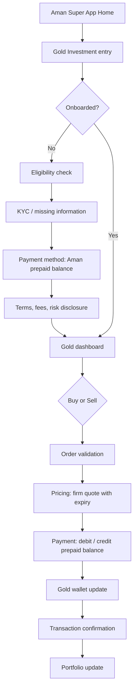
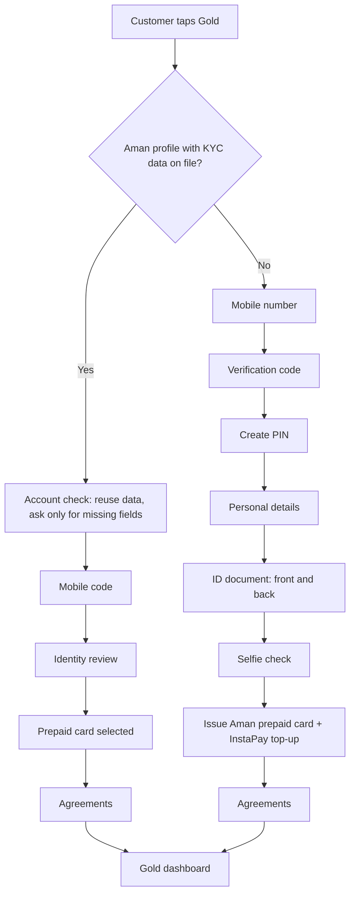

# Business flow and customer journey

## Business flow (mermaid)

## Onboarding paths

Prototype control "Customer scenario": (1) existing Aman customer, new to Gold; (2) brand-new customer, nothing on file; (3) existing investor (Ahmed, 20 transactions).
All identity checks are simulated; the list of required data is a configurable checklist, not a statement of legal requirements.

## Exception flows
| Exception | Trigger | Customer sees | System behaviour |
|---|---|---|---|
| Payment failed | Debit fails | "We couldn't complete your transaction." | No gold or cash moved |
| Price expired | Quote older than 30s or price moved 0.5%+ | "The gold price has changed. Please review the updated price." | New quote required |
| Insufficient balance | Total > prepaid balance | "You don't have enough available balance." + Top up via InstaPay | Order blocked |
| Insufficient gold | Sell > holdings | "You don't have enough gold to complete this sale." | Order blocked |
| KYC failure / incomplete | Required field missing | "Please complete your information before investing." | Trading blocked, onboarding link |
| Transaction failed | Provider or system error | "We couldn't complete your transaction." | Balances unchanged (prototype: toggle) |
| Provider unavailable | Partner down | "Gold investment is temporarily unavailable." | Trading disabled, holdings still visible |
| Market volatility | Rapid movement | "Gold prices are changing rapidly. Your final execution price may differ." | Banner on trade screens |

## Customer journey
| Stage | Customer thinks | Screen | Trust cue |
|---|---|---|---|
| Discover | "Gold on Aman?" | Home tile, Landing | Price, spread and risk shown upfront |
| Join | "Do I have to re-enter everything?" | Account check | Existing data reused |
| First buy | "What exactly will I pay?" | Amount, summary | Quantity, price, fee, total, lock timer |
| Confirm | "Did it work?" | Success | ID, before/after balances |
| Track | "Am I up or down?" | Dashboard, Portfolio | Realized vs unrealized P&L |
| Sell | "Where does my money go?" | Sell summary | "Credited to your Aman balance" |
