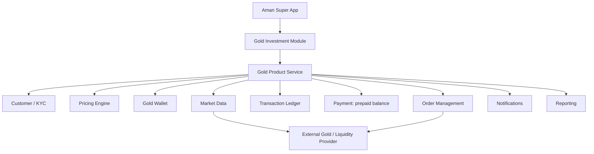

# Architecture, data model and pricing logic

## Target architecture (mermaid)

Separation: **customer experience** (`components`, `features`), **business logic** (`services/engine.ts`, `config`), **market data** (`services/pricing.ts`), **payment** (prepaid balance in store, gateway out of scope), **custody/provider** (external, TO VALIDATE), **ledger** (`Transaction[]`, single source of truth).

## Code map
| Path | Role |
|---|---|
| `config/product.ts` | Every business assumption (spread, fee, limits, quote validity, funding, KYC checklist) |
| `services/pricing.ts` | `MarketDataProvider` interface + mock; exports `getCurrentGoldPrice`, `getHistoricalGoldPrices`, `getBuyPrice`, `getSellPrice` |
| `services/engine.ts` | Quotes, validation, wallet math, transaction builders (pure functions) |
| `services/store.tsx` | Local state and persistence; swap for API/backend later |
| `data/seed.ts` | Demo customer and 11-transaction ledger (reconciled) |
| `features/*` | Screens, no business math |

## Data model
`Transaction`: id, type (BUY/SELL), ts, grams, pricePerGram, gross, fee, net, status, paymentMethod, cashBefore/After, goldBefore/After, realizedPnl?.
`Customer`: name, mobile, masked ID, dob, address (null = KYC incomplete), nationality.
`WalletSummary` (derived, never stored): grams, costBasis, avgBuyPrice, marketValue, unrealizedPnl, realizedPnl.

## Pricing logic (defaults are assumptions)
- Mid price from provider. Buy = mid x (1 + spread), sell = mid x (1 - spread); spread default 0.5% per side; fee default 0%.
- BUY: investment entered; fee added; grams = investment / buy price; total = investment + fee.
- SELL: grams (or EGP / sell price); gross = grams x sell price; net = gross - fee.
- Holdings valued at the **sell price** (what the customer would receive).
- Cost basis: average-cost method; buy fees added to basis. Unrealized = market value - cost basis. Realized = net proceeds - basis of gold sold.

## Replacing mocks
Implement `MarketDataProvider` against the provider and change the `provider` constant; replace `store.tsx` actions with API calls; keep `engine.ts` as the shared validation/calc library (or port to the backend).
